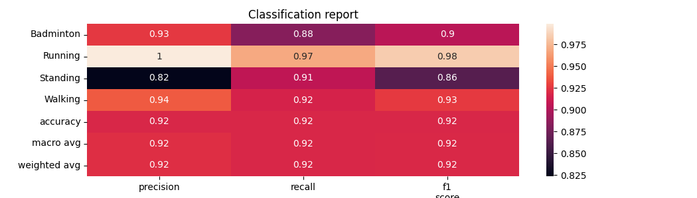
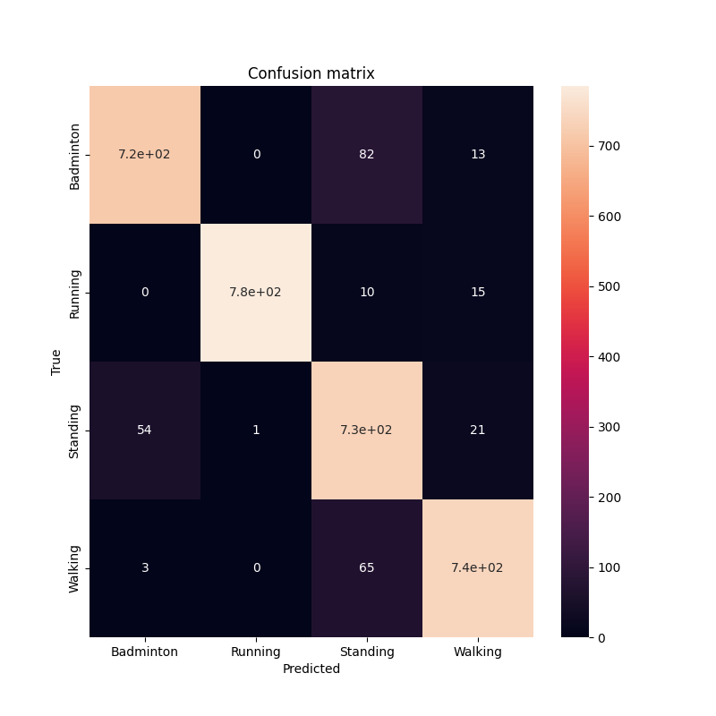
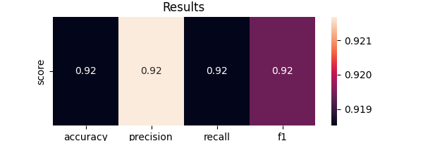
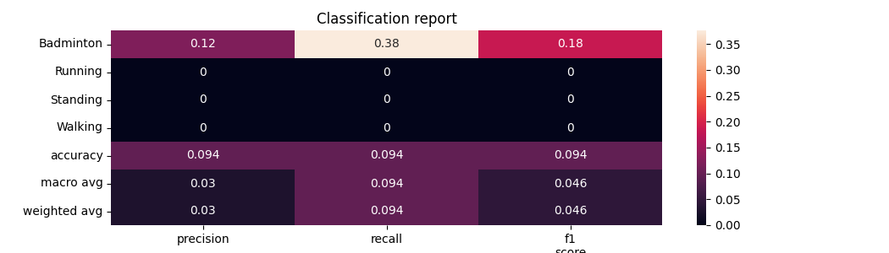
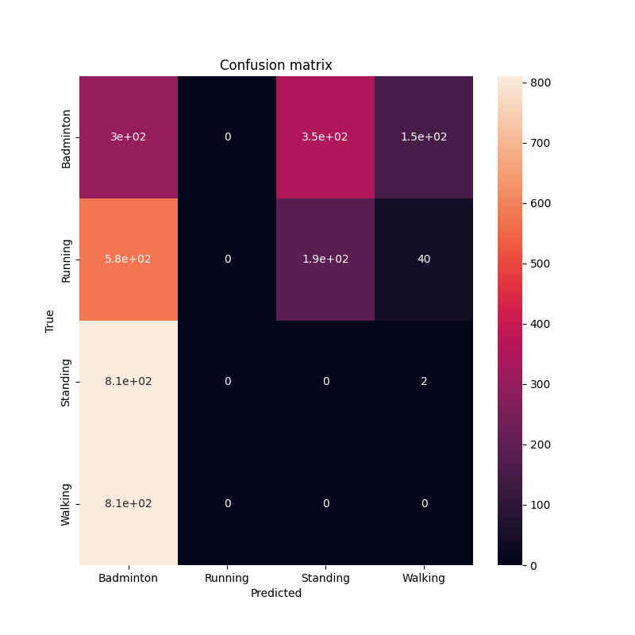
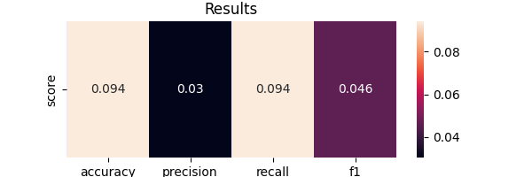

Markdown File Example
=====================

Contents
========

* [Overview](#overview)
	* [Structure of Repo](#structure-of-repo)
* [algorithms](#algorithms)
	* [Dealing with Imbalanced Data](#dealing-with-imbalanced-data)
	* [FC (Fully Connected) Network](#fc-fully-connected-network)
	* [Rocket data transformation](#rocket-data-transformation)
	* [InceptionTime](#inceptiontime)

# Overview


This repo contains experimental code used to implement both classical and deep learning methods for the task of univariate time series classification of short time series.

Classification is a supervised learning method used to classify observations into categorical classes (unlike regression in which the target is always a continuous number). Time series classification is the task of predicting the class of each time serie according to its temporal features.  
[*github link*](https://github.com/6110-CTO/classification_yishai)  

 The paper for each of the algorithm is provided in the corresponding section.  
 - The code is implementation libraries are: pytorch-lightning, sktime, sklearn, xgboost and clearml   
 - todo: fix - IMBALANCED DATA: The data is imbalanced, and the code is not handling it yet.  
 - todo: fix - The preprocessing and normalization is done using shap, confusion matrix and and accuracy  
 - todo: fix - The analysis is done using shap, confusion matrix and and accuracy
## Structure of Repo


```
classification_yishai/ 
    clearml_colab_agent.ipynb
    sktime/ 
        _run_rocket.ipynb
        02c_classification_multivariate_inceptiontime.ipynb
        utils.py
        _run_dl_classifiers.ipynb
        figures/ 
    explainer/ 
        explainwb.ipynb
    aspect angle/ 
        calc_aa.ipynb
    mutual_functions/ 
        plot_functions.py
        load_data.py
        imbalance.py
        evaluation_functions.py
        decorators.py
        normalization.py
        usefull_functions.py
    data_analysis/ 
        imbalance.ipynb
        feature_extract_tsfresh.ipynb
    transformers/ 
        transformer.py
        _run_model.ipynb
        script.py
        README.md
        utils.py
        multitask_transformer_class.py
        preprocessing.py
    FC/ 
        _run_model.ipynb
        fc.py
        utils_fc.py
        figures/ 
    transfer_learning/ 
        load_model_tsai.ipynb
        04_TimeSeries.ipynb
        models/ 
            models/ 
    spectrum/ 
        emd_tutorial_02_spectrum_03_crossfrequency.py
        emd_tutorial_02_spectrum_02_holospectrum.ipynb
        emd_tutorial_02_spectrum_01_hilberthuang.ipynb
        TS-emb.ipynb
        emd_tutorial_02_spectrum_03_crossfrequency.ipynb

```  
 - the code is tested on the UCR time series classification archive [*(link)*](http://www.timeseriesclassification.com/index.php)
# algorithms

## Dealing with Imbalanced Data


The code is based on the following papers: todo - add papers and finish implementation
## FC (Fully Connected) Network


The fully Connected network is a 3 layer implemention using by pytorch lightning.The network is trained with Adam optimizer and CrossEntropyLoss loss (logits output)The output is the argmax of the network's logits

The code is based on the following papers: todo - add papers

<p align="center">
    
</p>


<p align="center">
    
</p>


<p align="center">
    
</p>


## Rocket data transformation


The Rocket data transformation is with the MiniRocketMultivariate using ridge regression classifier.

The code is based on the following papers: todo - add papers

<p align="center">
    
</p>


<p align="center">
    
</p>


<p align="center">
    
</p>


## InceptionTime


The InceptionTime: todo 

The code is based on the following papers: todo - add papers

<p align="center">
    
</p>


<p align="center">
    
</p>


<p align="center">
    
</p>


## alg1 subheader2

### alg1 subheader3


``create_md_file()`` is the last command that has to be called.

```python
import Mdutils


mdFile = MdUtils(file_name='Example_Markdown',title='Markdown File Example')
mdFile.create_md_file()
```